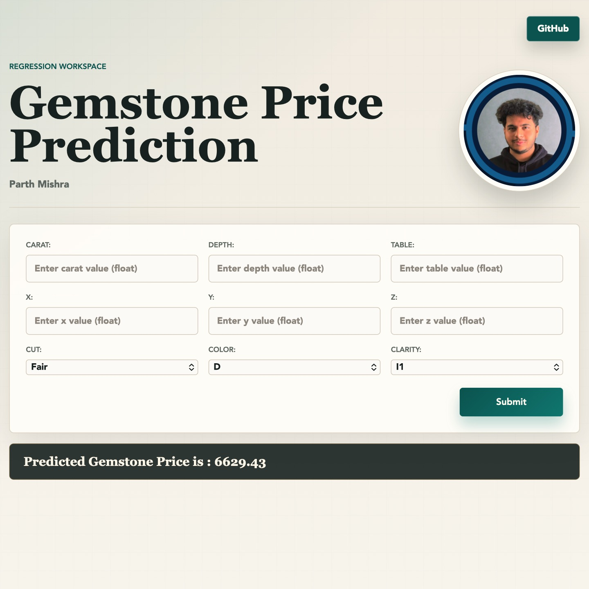

# Gemstone Price Prediction

An end-to-end regression project for predicting gemstone prices using a Flask web application, trained model artifacts, and Azure App Service deployment through GitHub Actions.

## Introduction About the Data

The goal is to predict the `price` of a diamond/gemstone using regression analysis.

There are 10 independent variables, including `id`:

* `id`: Unique identifier of each diamond
* `carat`: Unit of weight measurement used for gemstones and diamonds
* `cut`: Quality of diamond cut
* `color`: Diamond color grade
* `clarity`: Diamond clarity grade
* `depth`: Diamond height measured from culet to table
* `table`: Width of the diamond's top facet
* `x`: Diamond X dimension
* `y`: Diamond Y dimension
* `z`: Diamond Z dimension

Target variable:

* `price`: Price of the given diamond

Dataset source:
[Kaggle Playground Series S3E8](https://www.kaggle.com/competitions/playground-series-s3e8/data?select=train.csv)

The categorical variables `cut`, `color`, and `clarity` are ordinal in nature.

Reference:
[American Gem Society diamond grading system](https://www.americangemsociety.org/ags-diamond-grading-system/)

## Azure Deployment

This repository is configured for Azure App Service deployment using GitHub Actions.

Workflow file:

```text
.github/workflows/main_gempriceprediction.yml
```

The workflow runs on every push to `main`, installs dependencies from `requirements.txt`, uploads the application artifact, and deploys it to Azure App Service.

Before deployment, update these values if your Azure Web App uses a different name or secret:

* Azure Web App name in the workflow: `gempriceprediction`
* GitHub Actions secret used by the workflow: `AZURE_WEBAPP_PUBLISH_PROFILE`

## Application Routes

* `/`: Web UI for entering gemstone details and getting a price prediction
* `/predictAPI`: API endpoint for JSON-based predictions

## Application Preview



## Approach for the Project

1. Data Ingestion:
    * Read the dataset as a CSV file.
    * Split the data into training and testing datasets.
    * Save the generated data files.

2. Data Transformation:
    * Create a `ColumnTransformer` preprocessing pipeline.
    * Apply median imputation and standard scaling on numerical variables.
    * Apply most-frequent imputation, ordinal encoding, and scaling on categorical variables.
    * Save the preprocessor as a pickle file.

3. Model Training:
    * Train and evaluate base regression models.
    * Use CatBoost, XGBoost, and KNN in the final modeling approach.
    * Save the trained model as a pickle file.

4. Prediction Pipeline:
    * Convert input data into a dataframe.
    * Load the saved preprocessor and model artifacts.
    * Return the final prediction.

5. Flask App:
    * Serve a web UI for entering gemstone attributes.
    * Provide an API endpoint for prediction requests.

## Notebooks

Exploratory data analysis:
[EDA Notebook](./notebook/1_EDA_Gemstone_price.ipynb)

Model training:
[Model Training Notebook](./notebook/2_Model_Training_Gemstone.ipynb)

Model interpretation:
[LIME Interpretation](./notebook/3_Explainability_with_LIME.ipynb)

## License

This project uses the Apache-2.0 license. See [LICENSE](./LICENSE).
